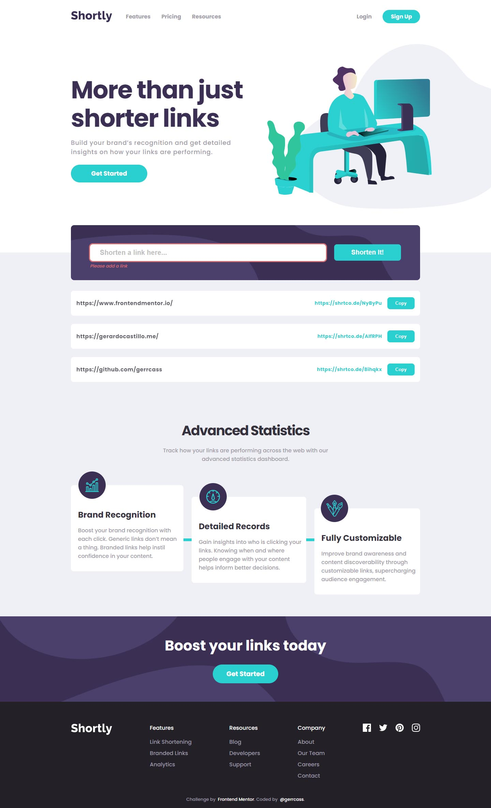

# Frontend Mentor - Shortly URL shortening API Challenge solution

This is a solution to the [Shortly URL shortening API Challenge challenge on Frontend Mentor](https://www.frontendmentor.io/challenges/url-shortening-api-landing-page-2ce3ob-G). Frontend Mentor challenges help you improve your coding skills by building realistic projects.

## Table of contents

- [Overview](#overview)
  - [The challenge](#the-challenge)
  - [Screenshot](#screenshot)
  - [Links](#links)
- [My process](#my-process)
  - [Built with](#built-with)
  - [What I learned](#what-i-learned)
  - [Useful resources](#useful-resources)
- [Author](#author)

## Overview

### The challenge

Users should be able to:

- View the optimal layout for the site depending on their device's screen size
- Shorten any valid URL
- See a list of their shortened links, even after refreshing the browser
- Copy the shortened link to their clipboard in a single click
- Receive an error message when the `form` is submitted if:
  - The `input` field is empty

### Screenshot

### Links

- Solution URL: [GitHub repo](https://github.com/gerrcass/url-shortening-api-master)
- Live Site URL: [My solution deployed on Vercel](https://url-shortening-api.gerardocastillo.me/)

## My process

### Built with

- [Next.js](https://nextjs.org/) - React framework
- [Formik](https://formik.org/) - Open Source form library for React
- [ShrtCode Link Shortener API](https://shrtco.de/docs) - A privacy-friendly URL Shortener
- [Sass](https://sass-lang.com/) - Preprocessor scripting language for CSS
- BEM naming convention
- Using localStorage & custom hook
- Mobile-first workflow
- Semantic HTML5 markup

### What I learned

I got the perfect project to practice my frontend skills for responsive design using Next.js. I wanted a project where I would have to make an API call on demand from the UI. This potentially renders new content to the UI and when the first render differs from what Next.js has rendered server-side, a problem arises (see resource link below). Since this project stores state in the browser's LocalStorage, you need to run that code inside a useEffect hook to ensure proper hydration, and since this code only runs client-side, you don't even need to check for `typeof window !== "undefined "`.

### Useful resources

- [React Hydration Error](https://nextjs.org/docs/messages/react-hydration-error) - When I tried to load the state from LocalStorage directly on the first render (ie the default state of useState hook), you're going to get this error.
- [Hydration failed because the initial UI does not match what was rendered on the server #35773](https://github.com/vercel/next.js/discussions/35773) - Before React 18, you'd only get an error in your browser's console, but with the new major you will encounter this error.

## Author

- Website - [Gerardo Castillo](https://gerardocastillo.me/)
- Frontend Mentor - [@gerrcass](https://www.frontendmentor.io/profile/gerrcass)
- LinkedIn - [@gerrcass](https://www.linkedin.com/in/gerrcass/)
